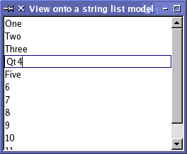
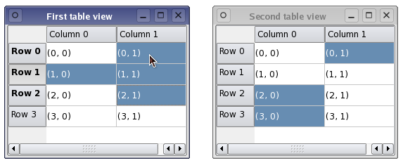
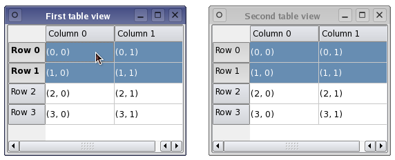
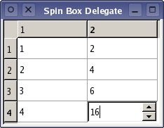

# 模型/视图 编程

## 模型/视图编程简介 
Qt中包含了一系列的项目视图类，他们使用了模型/视图架构来管理数据和显示之间的关系。此架构的功能分离特征给开发人员在自定义项目的呈现形式时带来了很大的灵活性，并提供标准的模型接口，以允许将各种数据源与现有项目视图一起使用。在本文档中，我们对模型/视图进行了简要介绍，概述了所涉及的概念，并描述了项目视图系统的结构特征。介绍了体系结构中的每个组件，并给出了示例，这些示例告诉我们如何使用所提供的类。

## 模型/视图体系架构

模型-视图-控制器（MVC）是源自 `Smalltalk` 的设计模式，在构建用户界面时经常使用。在[《设计模式》]()一书中，`Gamma` 等人写到：
> MVC 由三种对象组成。模型是应用程序对象，视图是其在屏幕上的呈现，控制器定义了用户界面对用户输入的反应方式。 在MVC之前，用户界面设计往往会将这些对象整合在一起。 MVC 使它们解耦以增加灵活性和重用性。

如果将视图和控制器对象组合在一起，就是模型/视图架构。基于将数据的存储方式与向用户呈现的方式分开的原理，模型/视图架构提供了一个更简单的框架。这种分离使得可以在几个不同的视图中显示相同的数据，并实现新的视图类型，而无需更改基础数据结构。为了灵活处理用户输入，我们引入了委托的概念。在此框架中使用委托的好处在于，它允许自定义呈现和编辑数据项的方式。

<div class="table">
<table class="generic">
<tbody>
<tr class="odd" valign="top"><td></td>
<td>
<b>模型/视图架构</b>
<p>模型与数据源通信，为架构中的其他组件提供接口。通信的性质取决于数据源的类型以及模型的实现方式。

视图从模型中获取模型索引； 这些索引是对数据项的引用。 通过向模型提供模型索引，视图可以从数据源检索出数据项。

在标准视图中，委托负责渲染显示数据项。 当编辑项目后，委托将直接通过模型索引与模型进行通信。
</p>
</p>
</td>
</tr>
</tbody>
</table>
</div>

通常，模型/视图类可以分为上述三个组：模型，视图和委托。这些组件中的每个组件都由抽象类定义，这些抽象类提供了公共接口，并在某些情况下提供了一些功能的默认实现。抽象类应被子类化，以提供其他组件期望的全部功能；当然也可以编写专用组件。

模型、视图和代理之间通过信号槽通信。

- 数据源的数据发生改变时模型将发射信号通知视图。
- 用户交互发生改变时，视图将发射相应的信号。
- 在编辑期间，委托将发射信号来告知模型和视图有关编辑器的状态。

## 模型
所有项目模型均基于 [QAbstractItemModel]() 类。此类定义一个接口，视图和委托使用该接口访问数据。数据本身不必存储在模型中。它可以保存在由单独的类，文件，数据库或某些其他应用程序组件提供的数据结构或存储库中。

有关模型的基本概念在[“模型类”]()部分中介绍。

[QAbstractItemModel]() 提供了一个数据接口，该接口足够灵活，可以处理以表，列表和树的形式表示数据的视图。但是，当为列表和类似表的数据结构实现新模型时，[QAbstractListModel]() 和 [QAbstractTableModel]() 类是更好的选择，因为它们提供了常用功能的默认实现。这些类中的每一个都可以被子类化以提供支持特殊类型的列表和表的模型。

在[创建新模型]()部分中讨论了模型子类化的过程。

Qt提供了一些现成的模型，可用于处理数据项：
- [QStringListModel]() 用于存储一列简单的 [QString]() 类型的项目。
- [QStandardItemModel]() 用于管理更复杂的树形结构项目，每个项目可以包含任意数据。
- [QFileSystemModel]() 提供有关本地归档系统中文件和目录的信息。
- [QSqlQueryModel]()，[QSqlTableModel]() 和 [QSqlRelationalTableModel]() 用于在使用模型/视图架构时访问数据库。

如果这些标准模型不满足您的要求，则可以将 [QAbstractItemModel]()，[QAbstractListModel]() 或 [QAbstractTableModel]() 子类化以创建您自己的自定义模型。

## 视图
Qt 提供了针对各种视图的完整实现：[QListView]() 用于显示项目列表，[QTableView]() 用于显示表结构模型的数据，[QTreeView]() 在一个分层次的结构列表中显示数据项。这些类均基于 [QAbstractItemView]() 抽象基类。尽管这些类都是已经实现好的，但也可以将它们子类化以提供满足我们需求的自定义视图。

所有可用的视图可在[“视图类”]()部分中进行查阅。

## 委托

[QAbstractItemDelegate]() 是模型/视图框架中委托的抽象基类。默认委托实现由 [QStyledItemDelegate]() 提供， Qt 中的标准视图都将其作为默认委托。但是，[QStyledItemDelegate]() 和 [QItemDelegate]() 是绘制和为视图中的项目提供编辑器的独立替代方法。它们之间的区别在于 [QStyledItemDelegate]() 使用当前样式来绘制其项目。因此，在实现自定义委托或使用 Qt 样式表时，建议将 [QStyledItemDelegate]() 用作基类。

委托在[“委托类”]()部分中进行了描述。

## 排序

在模型/视图架构中，有两种方法可以进行排序；选择哪种方法取决于底层使用的模型。

如果您的模型是可排序的，即重新实现 [QAbstractItemModel::sort()]() 函数，则 [QTableView]() 和 [QTreeView]() 都提供了API，可让您以编程方式对模型数据进行排序。 另外，通过将 [QHeaderView::sortIndicatorChanged()]() 信号连接到 [ QTableView::sortByColumn() ]() 槽函数或 [QTreeView::sortByColumn()]() 槽函数，可以启用交互式排序（即允许用户通过单击视图的标题对数据进行排序））。

如果您的模型没有所需的接口，或者如果您想使用列表视图来呈现数据，则另一种方法是在视图呈现数据之前，使用代理模型来转换模型的结构。 有关[代理模型]()的部分将对此进行详细介绍。

## 便利类

从标准视图类派生出了许多便利类，用于 Qt 中基于项目的项目视图类和表类，它们不打算被子类化。

比如 [QListWidget]()，[QTreeWidget]() 和 [QTableWidget]()。

这些类的灵活性不如视图类，并且不能与任意模型一起使用。我们建议您使用模型/视图方法来处理项目视图中的数据，除非您强烈需要一组基于项目的类。

如果希望在使用基于项目的接口的同时利用模型/视图方法提供的功能，请考虑将视图类（例如 [QListView]()，[QTableView]() 和 [QTreeView]() ）与 [QStandardItemModel]() 一起使用。


# 使用模型和视图

以下各节说明如何在 Qt 中使用模型/视图模型。每个部分都包含一个示例，紧接着是展示如何创建新组件。

## Qt 中包含的两个模型
Qt 提供的两个标准模型是 [QStandardItemModel]() 和 [QFileSystemModel]()。[QStandardItemModel]() 是一个多功能模型，可用于表示列表，表和树视图所需的各种不同的数据结构。该模型还保存数据项。[QFileSystemModel]() 是用于维护有关目录内容的信息的模型，它本身不保存任何数据项，而仅表示本地文件系统上的文件和目录。

[QFileSystemModel]() 提供了一个现成的模型用来测试使用，并且可以通过简单的配置就可以使用现有的数据。使用该模型，我们可以展示如何创建一个可用于现成视图的模型，并探索如何使用模型索引来操控数据。

# 通过现有模型使用视图

[QListView]() 和 [QTreeView]() 类是最适合与 [QFileSystemModel]()一起使用的视图。下面提供的示例是分别在树形视图和列表视图中显示相同的目录内容。这些视图共享用户的选择，以便在两个视图中突出显示所选的项目。


我们使用了现成的模型 [QFileSystemModel]()，并创建了一些视图来显示目录的内容。展示了使用模型的最简单方法。 该模型的构建和使用是在单个 `main()` 函数中执行的：

```cpp
int main(int argc, char *argv[])
{
    QApplication app(argc, argv);
    QSplitter *splitter = new QSplitter;

    QFileSystemModel *model = new QFileSystemModel;
    model->setRootPath(QDir::currentPath());
```

该模型被设置为使用来自特定文件系统的数据。调用 [setRootPath()]() 将告诉模型文件系统上的哪个驱动器会暴露给视图。

我们使用同一个模型创建两个不同的视图，来查看模型中的项目呈现出来的效果：

```cpp
QTreeView *tree = new QTreeView(splitter);
tree->setModel(model);
tree->setRootIndex(model->index(QDir::currentPath()));

QListView *list = new QListView(splitter);
list->setModel(model);
list->setRootIndex(model->index(QDir::currentPath()));
```

视图的构造方法与其他控件一样。设置视图来显示模型中的项目仅需使用目录模型作为参数来调用视图的 [setModel()]() 函数即可。我们通过在每个视图上调用 [setRootIndex()]() 函数来过滤模型提供的数据，并从文件系统模型中为当前目录传递合适的模型索引。

这种情况下对于 [QFileSystemModel]() 来说只能通过传递一个目录参数来使用 `index()` 函数获取索引，模型索引在[模型类]()部分中讨论。

该函数的其余部分是在分裂器控件中显示视图，并运行应用程序的事件循环：

```cpp
    splitter->setWindowTitle("Two views onto the same file system model");
    splitter->show();
    return app.exec();
}
```

在上面的示例中，我们忽略了如何处理项目选择。 在 [在项目视图中处理选择项]() 部分中将更详细地介绍。

# 模型类

在学习如何处理选择项之前，理解模型/视图框架中使用的概念是很有用的。

## 基本概念

在模型/视图体系结构中，模型提供了视图和委托用来访问数据的标准接口。在 `Qt` 中，标准接口由 [QAbstractItemModel]() 类定义。无论数据项如何存储在任何基础数据结构中，[QAbstractItemModel]() 的所有子类都将数据表示为一个有层次的包含项表的结构。视图使用此约定来访问模型中的数据项，但是它们向用户呈现此信息的方式不受限制。

 

模型通过信号槽机制通知所有附加视图有关数据更改的信息。

本节描述一些基本概念，这些概念对于其他组件通过模型类访问数据项的方式至关重要。 稍后的部分将讨论更高级的概念。

## 模型索引

为了确保数据的表示方式与访问方式分开，引入了模型索引的概念。通过模型获得的每条信息都由模型索引表示。视图和委托使用这些索引来请求要显示的数据项。

所以，只有模型需要知道如何获取数据和定义数据类型。模型索引包含一个指向创建它们的模型的指针，以免在使用多个模型时造成混淆。

```cpp
QAbstractItemModel *model = index.model();
```

模型索引提供了一个对信息的临时的引用，可用于通过模型检索或修改数据。由于模型可能会不时重组其内部结构，因此模型索引可能会变得无效，*不应进行存储*。如果需要长期使用一条信息，则必须创建一个*持久的模型索引*。这为模型保持最新状态提供了参考。临时模型索引由 [QModelIndex]() 类提供，而持久模型索引由 [QPersistentModelIndex]() 类提供。

要获得与数据项相对应的模型索引，必须为模型指定三个属性：行号，列号和父项的模型索引。以下各节将详细描述和解释这些属性。

## 行和列

在基本的形式中，可以将模型作为一个简单的表进行访问，项目按行和列的编号位于其中。*这并不意味着底层数据存储在数组结构中*；行号和列号的使用仅仅是组件之间相互通信的约定。我们可以通过在模型中指定给定项目的行号和列号来检索有关任何给定项目的信息，我们接收到的是代表该项目的索引：

```cpp
QModelIndex index = model->index(row, column, ...);
```

为简单的单层数据结构（例如列表和表）提供接口的模型不需要提供任何其他信息，但是，如上述代码所示，在获取模型索引时，我们需要提供更多信息。

<div class="table">
<table class="generic">
<tbody>
<tr class="odd" valign="top"><td></td>
<td>
<b>行和列</b>
<p>
该图显示了基本表模型的表示形式，其中每个项目都由一对行号和列号定位。通过将相关的行号和列号传递给模型，我们获得了一个引用数据项的模型索引。

```cpp
QModelIndex indexA = model->index(0, 0, QModelIndex());
QModelIndex indexB = model->index(1, 1, QModelIndex());
QModelIndex indexC = model->index(2, 1, QModelIndex());
```
始终通过用 `QModelIndex()` 指定为其父项来引用模型中的顶级项目。下一节将对此进行讨论。

</p>
</p>
</td>
</tr>
</tbody>
</table>
</div>

## 项的父项

当在表视图或列表视图中使用数据时，模型提供的类似于表的接口就非常合适。行号和列号系统准确地映射到视图显示项目的方式上。但是，诸如树状视图的结构对于模型项目的操作要求模型提供更灵活的接口。每个项目也可以是另一个项目表的父项，就像树状视图中的顶级项目可以包含另一个项目列表一样。

当请求模型项的索引时，我们必须提供有关该项父项的一些信息。在模型之外，引用项目的唯一方法是通过模型索引，因此还必须提供父模型索引：

```cpp
QModelIndex index = model->index(row, column, parent);
```

<div class="table">
<table class="generic">
<tbody>
<tr class="odd" valign="top"><td></td>
<td>
<b>父项、行和列</b>
<p>
该图展示了树模型的表示形式，其中每一项均由父项、行号和列号检索出来。

“A”和“C”项在模型中为同级顶级：

```cpp
QModelIndex indexA = model->index(0, 0, QModelIndex());
QModelIndex indexC = model->index(2, 1, QModelIndex());
```

“A”项有多个子代。使用以下代码获得“B”项的模型索引：

```cpp
QModelIndex indexB = model->index(1, 0, indexA);
```

</p>
</p>
</td>
</tr>
</tbody>
</table>
</div>

## 项角色

模型中的项可以为其他组件扮演各种不同的*角色*，从而可以为不同的数据提供不同的方案。 例如，[Qt::DisplayRole]() 用于访问可以在视图中显示为文本的字符串。通常，项包含许多不同角色的数据，标准角色由 [Qt::ItemDataRole]() 定义。

我们可以通过向模型传递与该项相对应的模型索引，并指定一个角色来获取所需的数据类型，从而获得我们想要的数据：

```cpp
QVariant value = model->data(index, role);
```

<div class="table">
<table class="generic">
<tbody>
<tr class="odd" valign="top"><td></td>
<td>
<b>项角色</b>
<p>
项角色向模型指示要引用的数据类型。视图可以以不同的方式显示角色，因此为每个角色提供适当的信息很重要。

[创建新模型]() 部分将更详细地介绍角色的某些特定用法。

</p>
</p>
</td>
</tr>
</tbody>
</table>
</div>

项标准角色 [Qt::ItemDataRole]() 涵盖了大部分常用的项角色。通过为每个角色提供适当的项目数据，模型可以向视图和委托提示如何将项呈现给用户。不同类型的视图可以根据自身需要解释或忽略此信息。也可以为特定目的定义其他角色。

## 摘要
- 模型索引以独立于任何底层数据结构的方式提供给视图和委托有关模型所提供项的位置的信息。
- 项通过其行号和列号以及其父项的模型索引检索出来。
- 模型索引是由模型根据其他组件（例如视图和委托）的请求构造出来的。
- 如果使用 [index()]() 请求索引时为父项指定了有效的模型索引，则返回的索引将引用模型中该父项之下的项。获得的索引指向该项目的子项。
- 如果使用 [index()]() 请求索引时为父项指定了无效的模型索引，则返回的索引引用模型中的顶级项。
- [角色]()用来区分与项关联的不同类型的数据。

## 使用模型索引

为了演示如何使用模型索引从模型中检索数据，我们设置了一个没有视图的 [QFileSystemModel]()，并在控件中显示文件和目录的名称。尽管这没有展示使用模型的正常方法，但是它说明了在处理模型索引时模型使用的规则。

[QFileSystemModel]() 加载是异步的，以最大程度地减少系统资源的使用。在处理此模型时，我们必须考虑到这一点。

我们通过以下方式构造文件系统模型：

```cpp
QFileSystemModel *model = new QFileSystemModel;
connect(model, &QFileSystemModel::directoryLoaded, [model](const QString &directory) {
    QModelIndex parentIndex = model->index(directory);
    int numRows = model->rowCount(parentIndex);
});
model->setRootPath(QDir::currentPath);
```

在这种情况下，我们首先设置默认的 [QFileSystemModel]() 。我们将其连接到 `lambda`，在其中我们将使用该模型提供的 `index()` 的特定实现来获取父索引。 在 `lambda` 中，我们使用 [rowCount()]() 函数计算模型中的行数。最后，我们设 [QFileSystemModel]() 的根路径，以便它开始加载数据并触发 `lambda` 。

为简单起见，我们只处理模型第一栏中的项目。我们依次检查每一行，获取每一行中第一项的模型索引，然后读取模型中为该项存储的数据。

```cpp
for (int row = 0; row < numRows; ++row) {
    QModelIndex index = model->index(row, 0, parentIndex);
```

为了获得模型索引，我们指定行号，列号（第一列为零），并为所需的所有项的父项指定适当的模型索引。使用模型的 [data()]() 函数检索存储在每个项目中的文本。我们指定模型索引和 [DisplayRole]() 获取字符串形式的项数据。

```cpp
QString text = model->data(index, Qt::DisplayRole).toString();
    // Display the text in a widget.

}
```
以上示例演示了从模型中检索数据的基本用法：
- 模型的大小范围可以使用 [rowCount()]() 和 [columnCount]() 获取到。这些函数通常需要指定一个父项模型索引。
- 模型索引用于访问模型中的数据项。指定一个项需要行、列和父项的模型索引。
- 通过 `QModelIndex()` 指定一个空的父项的索引来访问模型中的顶层项。
- 项包含不同角色的数据。要获得特定角色的数据，必须同时向模型提供模型索引和角色。

## 拓展阅读

可以通过提供了标准接口的 [QAbstractItemModel]() 类来创建新模型。在 [创建新模型]() 部分，我们将通过创建一个方便可用的保存字符串列表的模型来展示这一点。

# 视图类

## 概念

在模型/视图架构中，视图从模型中获取数据项并将其呈现给用户。呈现数据的方式不必类似于模型提供数据的方式，而可以与用于存储数据项的底层数据结构*完全不同*。

通过使用 [QAbstractItemModel]() 提供的标准模型接口，[QAbstractItemView]() 提供的标准视图接口以及使用表示数据项的模型索引来实现内容和表示的分离。视图通常管理从模型获得的数据的整体布局。它们可以自己呈现单个数据项，或使用委托来处理渲染和编辑功能。

除了显示数据外，视图还处理项目之间的导航以及项目选择。这些视图还实现了基本的用户界面功能，例如上下文菜单和拖放功能。视图可以提供项目的默认编辑功能，也可以与 [委托]() 一起使用以提供自定义编辑器。

可以在没有模型的情况下构造视图，但是必须提供模型才能显示有用的信息。视图通过使用 [选择项]() 来跟踪用户选择的项目，这些选择项可以被每个视图单独维护，或者在多个视图之间共享。

一些视图，例如 [QTableView]() 和 [QTreeView]()，需要显示表头和项目。这些由视图类 [QHeaderView]() 实现。表头通常与包含它们的视图访问的是同一个模型。他们使用 [QAbstractItemModel::headerData()]() 函数从模型中检索数据，并且通常以标签形式显示表头信息。可以继承 [QHeaderView]() 类实现新的标头，以为视图提供更专业的标签。

## 使用现有视图

Qt提供了三种现成的视图类，它们以大多数用户熟悉的方式显示来自模型的数据。 [QListView]() 可以将模型中的项目显示为简单列表或经典图标视图的形式。[QTreeView]() 将模型中的项目显示为具有层次结构的列表，从而以紧凑的方式表示深层嵌套的结构。[QTableView]() 以表格的形式显示来自模型的项目，非常类似于电子表格应用程序的布局。


上面显示的标准视图的默认行为对于大多数应用程序来说应该足够了。它们提供了基本的编辑功能，并且可以进行定制以满足更专业的用户界面的需求。

### 使用模型

我们以创建的字符串列表模型为例，设置一些数据，并构造一个视图以显示模型的内容。所有这些都可以在一个函数中执行：

```cpp
int main(int argc, char *argv[])
{
    QApplication app(argc, argv);

    // Unindented for quoting purposes:
    QStringList numbers;
    numbers << "One" << "Two" << "Three" << "Four" << "Five";

    QAbstractItemModel *model = new StringListModel(numbers);
```

请注意，`StringListModel` 被声明为 [QAbstractItemModel]()。这使我们能够使用模型的抽象接口，并确保即使我们将字符串列表模型替换为其他模型，代码仍然可以正常工作。

[QListView]() 提供的列表视图足以在字符串列表模型中显示项目。我们构造视图，并使用以下代码行建立模型：

```cpp
    QListView *view = new QListView;
    view->setModel(model);
```

该视图以正常方式显示：

```cpp
    view->show();
    return app.exec();
}
```

视图渲染显示模型中的内容，并通过模型的接口访问数据。当用户尝试编辑项目时，视图使用默认委托提供一个默认的编辑器控件。



上图显示了 [QListView]() 如何显示字符串列表模型中的数据。由于模型是可编辑的，因此视图允许使用默认委托来编辑列表中的每个项目。

### 多个视图共用一个模型

为同一模型提供多个视图仅是为每个视图设置相同模型的问题。在下面的代码中，我们创建了两个表视图，每个表视图都使用了创建的简单的表模型：

```cpp
    QTableView *firstTableView = new QTableView;
    QTableView *secondTableView = new QTableView;

    firstTableView->setModel(model);
    secondTableView->setModel(model);
```

在模型/视图架构中使用信号槽可以将对模型的更改传递给到所有设置该模型的视图，从而确保我们始终可以访问相同的数据，而不管所使用的视图如何。



上面的两张图片显示了两种不同的视图使用同一个模型的情况，每一个视图都包含一些被选中的项。尽管在视图中始终显示来自模型的数据，但每个视图都维护一个自己内部的选择模型。在某些情况下这可能很有用，但是对于许多应用程序来说，需要一个共享的选择模型。

## 处理项目选择

[QItemSelectionModel]() 类提供了用于处理视图中项目选择的机制。默认情况下，所有标准视图都构建自己的选择模型，并以常规方式与其交互。可以通过 [selectionModel()]() 函数获得视图使用的选择模型，并可以使用 [setSelectionModel]() 指定替换选择模型。当我们想在同一模型数据上提供多个一致的视图时，控制视图使用的选择模型的功能非常有用。

通常，除非要对模型或视图进行子类化，否则无需直接操作选择的内容。但是，如果需要，可以访问选择模型的接口，这在[在项目视图中出路选择项]()部分中进行了探讨。

### 在视图之间共享选择

尽管默认情况下视图类提供它们自己的选择模型很方便，但是当我们在同一个模型上使用多个视图时，通常希望在所有视图中都同时显示模型的数据和用户的选择。由于视图类允许替换其内部选择模型，因此我们可以使用以下代码在视图之间实现统一选择：

```cpp
    secondTableView->setSelectionModel(firstTableView->selectionModel());
```

为第二个视图提供了第一个视图的选择模型。现在，两个视图都在相同的选择模型上运行，从而使数据和所选项目保持同步。



在上面显示的示例中，使用了两个相同类型的视图来显示相同模型的数据。但是，如果使用两种不同类型的视图，则在每个视图中所选项目的表现方式可能会非常不同。例如，表视图中的连续选择在树状图视图中就表现为一系列分散的高亮项的片段。

## 委托类

### 概念

与“模型-视图-控制器”模式不同，模型/视图设计不包括用于管理与用户交互的完全独立的组件。通常，视图负责将模型数据呈现给用户，并负责处理用户输入。为了使获取此输入的方式具有一定的灵活性，交互由委托执行。这些组件提供输入功能，还负责在某些视图中渲染单个项目。在 [QAbstractItemDelegate]() 类中定义了用于控制委托的标准接口。

委托应该能够通过实现 [paint()]() 和 [sizeHint()]() 函数来呈现它们自己的内容。但是，基于简单窗口控件的委托可以继承　[QStyledItemDelegate]() 而不是 [QAbstractItemDelegate]() 类，并使用这些函数的默认实现。

委托编辑器可以通过使用控件来管理编辑过程或直接处理事件来实现。本节稍后将介绍第一种方法，在 [SpinBox委托]() 示例中也有相应的实现。

[Pixelator]() 示例显示了如何创建自定义委托来专门渲染一个表视图。

### 使用现有的委托

`Qt` 提供的标准视图使用 [QStyledItemDelegate]() 实例提供编辑功能。委托接口的默认实现以通用的样式为每个标准视图 [QListView]()，[QTableView]() 和 [QTreeView]() 呈现项目。

所有标准角色均由标准视图使用的默认委托处理。[QStyledItemDelegate]() 文档中描述了这些解释的方式。

视图使用的委托由 [itemDelegate()]() 函数返回。[setItemDelegate()]() 函数允许为标准视图设置自定义委托，并且在为自定义视图设置委托时必须使用此函数。

### 一个简单的委托

此处实现的委托使用 [QSpinBox]() 提供编辑功能，并且主要用于显示整数的模型。因此我们建立了一个基于整数的自定义的表模型，但是由于自定义委托控制数据输入，因此我们可以轻松地使用 [QStandardItemModel]()。 我们构造一个表视图来显示模型的内容，使用自定义委托进行编辑。



我们从 [QStyledItemDelegate]() 继承实现自定义委托，因为我们不想编写自定义显示函数。但是，我们仍然必须提供函数来管理编辑器控件：

```cpp
class SpinBoxDelegate : public QStyledItemDelegate
{
    Q_OBJECT

public:
    SpinBoxDelegate(QObject *parent = nullptr);

    QWidget *createEditor(QWidget *parent, const QStyleOptionViewItem &option,
                          const QModelIndex &index) const override;

    void setEditorData(QWidget *editor, const QModelIndex &index) const override;
    void setModelData(QWidget *editor, QAbstractItemModel *model,
                      const QModelIndex &index) const override;

    void updateEditorGeometry(QWidget *editor, const QStyleOptionViewItem &option,
                              const QModelIndex &index) const override;
};
```

注意，在构造委托时，不会设置任何编辑器控件。我们仅在需要时构造一个编辑器控件。

### 提供一个编辑器

在此示例中，当表视图需要提供编辑器时，要求委托提供适合于项目修改的编辑器控件。[createEditor()]() 函数可以让委托能够设置合适的控件作为编辑器：

```cpp
QWidget *SpinBoxDelegate::createEditor(QWidget *parent,
                                       const QStyleOptionViewItem &/* option */,
                                       const QModelIndex &/* index */) const
{
    QSpinBox *editor = new QSpinBox(parent);
    editor->setFrame(false);
    editor->setMinimum(0);
    editor->setMaximum(100);

    return editor;
}
```

注意，我们不需要保留指向编辑器控件的指针，因为当视图不再需要该编辑器时，负责将其销毁。

我们在编辑器上安装了委托的默认事件过滤器，以确保它提供用户期望的标准编辑快捷方式。可以将其他快捷方式添加到编辑器中，以允许更复杂的行为。这些内容将在 [编辑提示]() 部分中进行讨论。

视图可通过调用稍后我们定义的函数来确保正确设置编辑器的数据和几何形状。我们可以根据视图提供的模型索引创建不同的编辑器。例如，如果我们有一列整数和一列字符串，则可以返回 `QSpinBox` 或 `QLineEdit`，具体取决于正在编辑的列。

委托必须提供将模型数据复制到编辑器中的功能。在此示例中，我们读取了 [显示角色]() 中存储的数据，并在 `spin box` 中相应地设置了值。

```cpp
void SpinBoxDelegate::setEditorData(QWidget *editor,
                                    const QModelIndex &index) const
{
    int value = index.model()->data(index, Qt::EditRole).toInt();

    QSpinBox *spinBox = static_cast<QSpinBox*>(editor);
    spinBox->setValue(value);
}
```

在此示例中，我们知道编辑器控件是一个 `spin box`，但是我们可以为模型中的不同类型的数据提供不同的编辑器，在这种情况下，我们需要在访问其成员函数之前将控件转换为适当的类型。

### 提交数据到模型

当用户完成在 `spin box` 中的值编辑后，视图通过调用 [setModelData()]() 函数要求委托将已编辑的值存储在模型中。

```cpp
void SpinBoxDelegate::setModelData(QWidget *editor, QAbstractItemModel *model,
                                   const QModelIndex &index) const
{
    QSpinBox *spinBox = static_cast<QSpinBox*>(editor);
    spinBox->interpretText();
    int value = spinBox->value();

    model->setData(index, value, Qt::EditRole);
}
```

由于视图管理委托的编辑器控件，因此我们只需要使用提供的编辑器的内容来更新模型。在这种情况下，我们确保 ` spin box ` 是最新的，并使用指定的索引更新模型数据。

标准 [QStyledItemDelegate]() 类在完成编辑后通过发出 [closeEditor()]() 信号通知视图。该视图确保编辑器控件已关闭并销毁。在此示例中，我们仅提供简单的编辑工具，因此我们永远不需要发出此信号。

数据的所有操作都是通过 [QAbstractItemModel]() 提供的接口执行的。这使委托在很大程度上不受其处理的数据类型的影响，但是必须做出一些假设才能使用某些类型的编辑器控件。在此示例中，我们假定模型始终包含整数值，但是我们仍然可以将此委托与其他类型的模型一起使用，因为 [QVariant]() 为意外的数据提供了合理的默认值。

### 更新编辑器的几何图形

委托负责管理编辑器的几何图形。创建编辑器时以及更改项目的大小或在视图中的位置时，必须设置几何形状。幸运的是，视图在 [视图选项]() 对象内提供了所有必要的几何信息。

```cpp
void SpinBoxDelegate::updateEditorGeometry(QWidget *editor,
                                           const QStyleOptionViewItem &option,
                                           const QModelIndex &/* index */) const
{
    editor->setGeometry(option.rect);
}
```

在这种情况下，我们仅使用了视图选项提供的项的矩形几何信息。具有多个元素的项目的委托将不会直接使用项目矩形几何信息。它将编辑器放置在相对于其它项的位置。

### 编辑提示
编辑后，委托应向其他组件提供有关编辑过程结果的提示，并提供有助于后续任何编辑操作的提示。这是通过发出一个带有适当提示的 [closeEditor()]() 信号来实现的。 默认情况下，这是由我们在构造 `spin box` 时安装的 [QStyledItemDelegate]() 事件过滤器来处理的。

`spin box` 的行为可以进行调整，以使其更加用户友好。在 [QStyledItemDelegate]() 提供的默认事件过滤器中，如果用户单击 `Return` 确认在 `spin box` 中的选择，则委托将值提交给模型并关闭 `spin box` 。我们可以通过在 `spin box` 上安装我们自己的事件过滤器来更改此行为，并提供我们需要的编辑提示。例如，我们可以发出带有 [EditNextItem]() 提示的 [closeEditor()]() 信号来自动开始编辑视图中的下一个项目。

另一种不需要使用事件过滤器的方法是提供我们自己的编辑器控件，为方便起见，可能将 [QSpinBox]() 子类化。这种替代方法可以使我们更好地控制编辑器控件的行为，而无需编写其他代码。如果需要自定义标准 `Qt` 编辑器窗口控件的行为，简单常用的方法就是在委托中安装事件过滤器。

委托不必发出这些提示，但是为了应用程序的更加可用，我们需要发出提示以支持常见编辑操作。

# 处理项目视图中的选择项

## 概念

项目视图类中使用的选择模型对基于模型/视图架构的选择提供了的一般描述。尽管用于提供选择的标准视图足以处理提供的项目视图，但是选择模型允许创建专门的选择模型，以适合项目模型和视图的要求。

视图中被选择的项目的信息存储在一个 [QItemSelectionModel]() 类的实例中。它负责维护单个模型中项目的模型索引，并且独立于任何视图。由于模型上可以有很多视图，因此可以在视图之间共享选择，从而允许应用程序以一致的方式显示多个视图。

选择由*选择范围*指定。只需记录每一个选择范围开始和结束的模型索引即可，这些有效地维护了有关大量项目选择的信息。非连续的选择可以使用多个选择范围来描述。

 选择可以看作是在选择模型中保存的一个模型索引集合，最近的项目选择被称为*当前选择*。即使在应用了某些类型的选择命令后，也可以修改此选择的效果。这些将在本节后面讨论。

### 当前视图和被选择的项目
 
 视图中总有一个当前项目和一个被选择的项目，两者时两个独立的状态。在同一时间，一个项目既可以是当前项目也同时可以是被选择的项目。视图图则确保总是有一个项目作为当前项目来实现键盘导航。

 下表显示了当前项目和被选择的项目的区别。

 |当前项目|被选择的项目|
 |-------|-------|
 |只能有一个当前项目|可以有多个被选择的项目|
 |使用键盘导航键或者鼠标按键可以改变当前项目|项目是否处于被选择状态，取决于用户交互时当前几个预定义好的模式，比如单项选择、多重选择等|
 |如果按下 `F2` 键或者双击都可以编辑当前项目（前提是允许编辑）|当前项目可以指定一个范围来一起选择或者取消选择（或者两种混用）|
 |当前项目会显示焦点矩形|被选择的项目会使用选择矩形来表示|

 当操作选择时，可以将 [QItemSelectionModel]() 看作是一个项目模型中所有项目的选择状态的一个记录。一旦设置了一个选择模型，所有的集合项目都可以被选择、取消选择或者切换选择状态，而不需要知道哪一个项目已经被选择了。所有被选择的项目的索引都可以被随时进行检索，其他的组件也可以通过信号槽机制来获取选择模型的改变信息。

 ## 使用选择模型

 标准的视图类中提供了默认的选择模型，可以在大多数的应用中直接使用。属于一个视图的选择模型可以使用这个视图的 [ setSelectionModel()]() 获得，而且还可以在多个视图之间使用 [ setSelectionModel()]() 函数来共享该选择模型，所以一般是不需要重新构建一个选择模型的。

 通过指定一个模型和一对指向 [QItemSelection]() 的模型索引来创建选择。使用索引来引用给定模型中的项目，并将它们解释为所选项目块中的左上和右下项目。要将选择应用于模型中的项目，需要将选择提交给选择模型。这可以通过多种方式来实现，每种方式都对选择模型中已经存在的选择产生不同的影响。

 ### 选择项目

 为了演示选择的一些主要功能，我们构造了一个总共有32个项目的自定义表格模型实例，并将其设置给表格视图：

 ```cpp
     TableModel *model = new TableModel(8, 4, &app);

    QTableView *table = new QTableView(0);
    table->setModel(model);

    QItemSelectionModel *selectionModel = table->selectionModel();
 ```

 检索表视图的默认选择模型以供以后使用。我们不修改模型中的任何项目，而是选择一些显示在表左上方的一些项目。为此，我们需要检索与要选择的区域中的左上和右下项目相对应的模型索引：

 ```cpp
    QModelIndex topLeft;
    QModelIndex bottomRight;

    topLeft = model->index(0, 0, QModelIndex());
    bottomRight = model->index(5, 2, QModelIndex());
 ```

 要在模型中选择这些项目，并在表视图中查看相应的更改，我们需要构造一个选择对象，然后将其应用于选择模型：
 
 ```cpp
    QItemSelection selection(topLeft, bottomRight);
    selectionModel->select(selection, QItemSelectionModel::Select);
 ```

 使用 [选择标志]() 的组合定义的命令将选择应用于选择模型。在这种情况下，所使用的标志使得记录在选择对象中的项目被包括在选择模型中，而与它们先前的状态无关。视图显示结果选择。

 

 在示例模型上执行的命令都涉及到累积模型中各项的选择。也可以清除选择，或用新选择替换当前选择。

 要将当前选择替换为新选择，请将其他选择标志与 [当前]() 标志组合。使用此标志的命令指示选择模型将其当前模型索引集合替换为对 [select()]() 的调用中指定的模型索引集合。要在开始添加新选择之前清除所有选择，将其他选择标记与 [清除]() 标记结合使用。它的作用是重置选择模型的模型索引集合。

 ### 选择模型中的所有项目

 要选择模型中的所有项目，必须为模型的每个级别创建一个选择，以覆盖该级别中的所有项目。为此，我们使用给定的父索引检索与左上和右下项目相对应的索引：

 ```cpp
     QModelIndex topLeft = model->index(0, 0, parent);
     QModelIndex bottomRight = model->index(model->rowCount(parent)-1,
        model->columnCount(parent)-1, parent);
 ```

 使用这些索引和模型构建选择。然后在选择模型中选择相应的项目：

```cpp
    QItemSelection selection(topLeft, bottomRight);
    selectionModel->select(selection, QItemSelectionModel::Select);
``` 

需要对模型中的所有级别执行此操作。对于顶级项目，通常将以定义父索引的方式：

```cpp
    QModelIndex parent = QModelIndex();
```

对于分层模型，[hasChildren()]() 函数用于确定任何给定项目是否是另一级别项目的父项。

## 创建新模型


